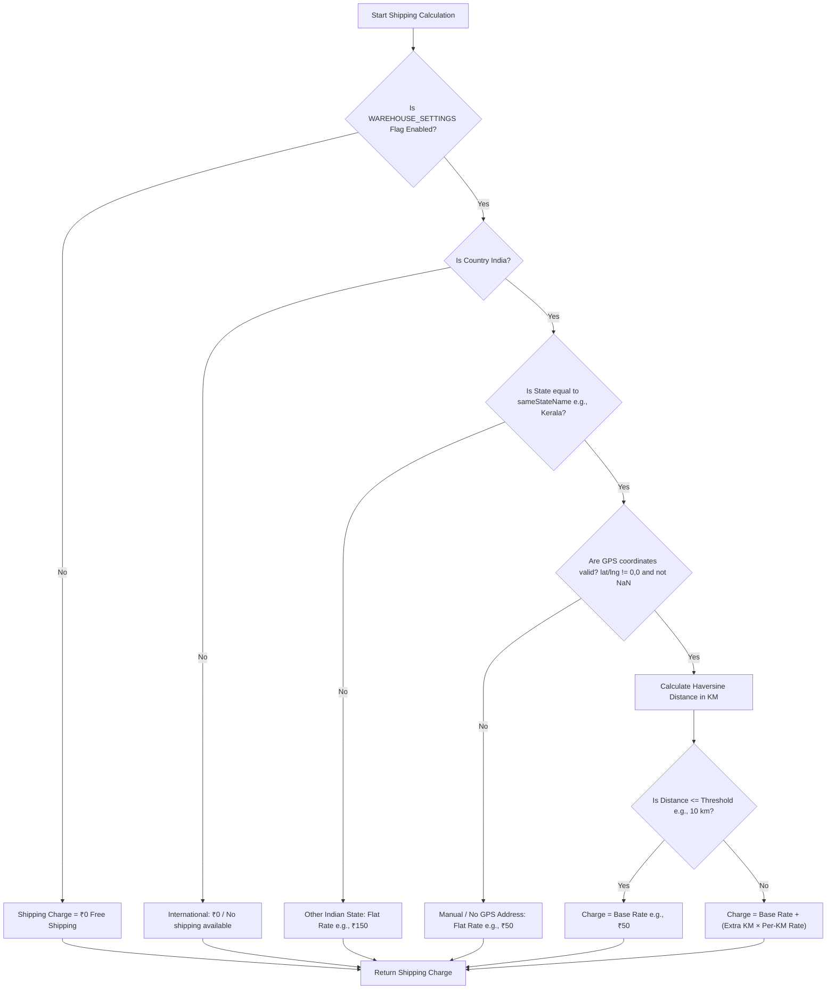

# Warehouse Shipping Calculation Documentation

This document describes how shipping fees are calculated in the backend system.

---

## 1. High-Level Flow Chart

---

## 2. Feature Flag Control
The application checks the `WAREHOUSE_SETTINGS` feature flag status in the database (`prisma.featureFlag`):
- **If Disabled:** Shipping is completely free (`₹0`).
- **If Enabled (Default):** Proceed to the standard geo-distance and state-based calculation rules below.

---

## 3. Shipping Configurations (Database vs. Defaults)

Shipping calculations depend on settings read dynamically from the database (`AppSetting` table) via the `getShippingConfigFromDB()` and `getWarehouseCoords()` utilities. If these are not configured, the system falls back to predefined environment variables or hardcoded values.

### A. Warehouse Coordinates
*   **Source:** `AppSetting` keys `WAREHOUSE_LAT` and `WAREHOUSE_LNG`.
*   **Defaults:** Falls back to environment variables `env.WAREHOUSE_LAT` and `env.WAREHOUSE_LNG`, or hardcoded Kerala defaults:
    *   **Latitude:** `9.9312`
    *   **Longitude:** `76.2673`

### B. Shipping Rate Settings
| DB Setting / Key | Default Value | Description |
| :--- | :--- | :--- |
| `SHIPPING_SAME_STATE` | `Kerala` | The home state name for local shipping rules. |
| `SHIPPING_OTHER_STATE_FLAT` | `₹150` | Flat rate charge for Indian states other than the home state. |
| `SHIPPING_SAME_STATE_BASE` | `₹50` | Base shipping charge for same-state deliveries. |
| `SHIPPING_SAME_STATE_FREE_KM` | `10 km` | Distance threshold (in km) where only the base rate is charged. |
| `SHIPPING_SAME_STATE_PER_KM` | `₹5` | Per-kilometer surcharge applied beyond the free distance threshold. |
| `SHIPPING_MANUAL_FLAT` | `₹50` | Flat rate for home state orders when customer coordinates are missing. |

---

## 4. Detailed Calculation Logic

The core logic is implemented in [shipping.service.ts](file:///d:/ARUN_UDAYAN_WEB_DEVELOPMENT/boutique_frontend-hari_1/boutique_backend-main/src/services/shipping.service.ts):

### Step 1: Country Check (International Orders)
*   If the address country is **not** India (case-insensitive):
    *   Returns **₹0** shipping charge.
    *   Type label: `No international shipping available`.
    *   *Note: Pay on Delivery (POD) orders explicitly block non-India checkouts at the endpoint level.*

### Step 2: State Check (Out-of-State Orders)
*   If the address state does **not** match the configured `sameStateName` (e.g., not `"Kerala"`):
    *   Returns a flat rate of `otherStateFlatRate` (Default: **₹150**).

### Step 3: Location Check (Same-State without GPS)
*   If the customer address does not have valid GPS coordinates (latitude or longitude are empty, `0`, or `NaN`):
    *   Returns a flat rate of `manualFlatRate` (Default: **₹50**).

### Step 4: Distance Calculation (Same-State with GPS)
*   If the address is in the home state and has valid coordinates, the straight-line distance (in kilometers) between the warehouse and the delivery location is calculated using the **Haversine formula**:

$$d = 2R \arcsin\left(\sqrt{\sin^2\left(\frac{\Delta \text{lat}}{2}\right) + \cos(\text{lat}_1) \cos(\text{lat}_2) \sin^2\left(\frac{\Delta \text{lon}}{2}\right)}\right)$$

Where $R = 6371 \text{ km}$ (Earth radius).

*   **Case A (Within base threshold):** If the calculated distance is less than or equal to `sameStateFreeKmThreshold` (Default: **10 km**):
    $$\text{Shipping Charge} = \text{sameStateBaseRate} \quad (\text{Default: } \text{₹50})$$
*   **Case B (Exceeding threshold):** If the distance exceeds the threshold:
    $$\text{Extra Distance} = \text{round}(\text{Distance} - 10 \text{ km})$$
    $$\text{Shipping Charge} = \text{sameStateBaseRate} + (\text{Extra Distance} \times \text{sameStatePerKmRate}) \quad (\text{Default: } \text{₹50} + \text{Extra Distance} \times \text{₹5})$$

---

## 5. Technical Implementation References

- **Calculation Core:** [shipping.service.ts](file:///d:/ARUN_UDAYAN_WEB_DEVELOPMENT/boutique_frontend-hari_1/boutique_backend-main/src/services/shipping.service.ts) contains the math and condition checking.
- **Config & Warehouse Fetching:** [warehouseSettings.ts](file:///d:/ARUN_UDAYAN_WEB_DEVELOPMENT/boutique_frontend-hari_1/boutique_backend-main/src/utils/warehouseSettings.ts) reads database overrides and handles hardcoded fallbacks.
- **Checkout Controller Integration:**
  - Online Orders: `placeOrder` in [order.controller.ts](file:///d:/ARUN_UDAYAN_WEB_DEVELOPMENT/boutique_frontend-hari_1/boutique_backend-main/src/controllers/order.controller.ts#L173-L181)
  - Pay on Delivery (POD) Orders: `placeOrderPOD` in [order.controller.ts](file:///d:/ARUN_UDAYAN_WEB_DEVELOPMENT/boutique_frontend-hari_1/boutique_backend-main/src/controllers/order.controller.ts#L450-L459)
- **Address Selection / Preview:** [address.controller.ts](file:///d:/ARUN_UDAYAN_WEB_DEVELOPMENT/boutique_frontend-hari_1/boutique_backend-main/src/controllers/address.controller.ts) triggers the preview estimation.
